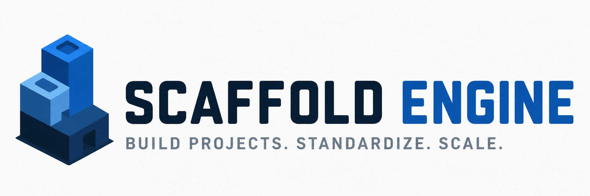

<p align="center">
  
</p>

<br>

# 🚀 Scaffold Engine

Scaffold Engine is a Python CLI designed to provide a standardized and reproducible approach to project scaffolding using Cookiecutter and Cruft.

The project focuses on template execution, lifecycle management, and maintaining consistency across data and platform environments. It is currently under active development.

**Keywords:** cookiecutter, scaffolding, python, cli, mlops, data-engineering, cruft.

## 📌 Overview

Scaffold Engine is designed as an execution layer for templates, enabling the creation and maintenance of projects in a standardized, reproducible, and scalable way.

The focus of the project is not to create templates, but to execute, manage, and evolve them over time.

## 🚀 Problem

Data and platform teams often face:

- Inconsistent project structures
- Manual and error-prone setup
- Template drift over time
- Lack of governance in project creation

Scaffold Engine emerges to centralize template execution and control.

## ⚙️ Features

- Support for local and remote templates
- Versioning and metadata tracking
- Integration with Cruft for template updates
- Modular and extensible architecture
- CLI as the main interface
- Decoupling of template logic

## 🧠 Architecture

Based on clean architecture principles:

- No domain logic inside the engine
- No coupling with templates
- High reusability across different contexts

## 🎯 Use Cases

- 📊 Data Science projects
- 🤖 MLOps pipelines
- 🌐 APIs and microservices
- 🏗️ Data platforms
- 📦 Analytical workflows

## 📦 Installation

### 🔥 Recommended (isolated CLI environment)

```bash
pipx install scaffold-engine
```

> Ensures an isolated environment and avoids dependency conflicts.

## 🛠️ Development

Install dependencies:

```bash
$ poetry install
```

Run locally:

```bash
poetry run scaffold --help
poetry run scaffold hello
```

## 📊 Expected Impact

- Reduced project setup time
- Reproducibility across environments
- Structural standardization
- Controlled template evolution
- Reduced technical debt

## 🗂️ Project Structure (in progress)

```
scaffold-engine/
│
├── engine/
│   ├── cli.py
│   ├── service.py
│   ├── providers/
│   ├── steps/
│   └── domain/
│
├── tests/
├── pyproject.toml
├── poetry.lock
├── README.md
└── LICENSE
```

## 🧭 Philosophy

Scaffold Engine acts as an execution layer:

- Executes templates
- Manages versions
- Keeps projects up to date

## 🔗 Links

- Source code: https://github.com/dscalexandre/scaffold-engine
- Documentation: (coming soon)

## 🤝 Contributions

Contributions will be welcome as the project evolves.

## 📄 License

MIT License

## 💡 Author

**Alexandre Rodrigues**
Data Science | Analytics | Data Engineering

## ⭐ Note

If you find this project useful, consider giving it a ⭐ on the repository
